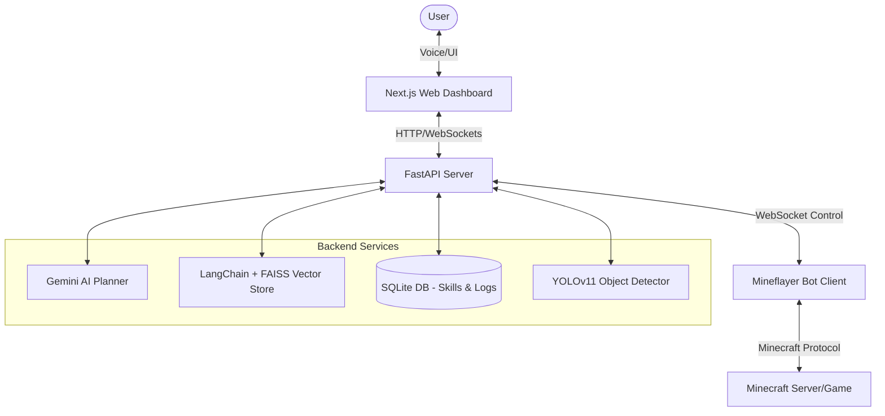

# Minecraft AI Agent

Minecraft AI Agent is a production-ready, autonomous AI agent platform inspired by Voyager. The agent utilizes **Google Gemini API** for strategic multi-step planning and dynamic JavaScript/TypeScript code skill generation, a local **FAISS vector database** for coordinate location memory search, a **YOLOv11** vision-radar pipeline, and a stunning futuristic glassmorphic Next.js web dashboard with 3D cybernetic particle visualizers and native voice recognition control.

---

## Architecture Diagram



---

## Core Technical Features

1. **AI Strategic Planner**:
   - Decomposes high-level instructions (e.g., `"Get me an iron pickaxe"`) into structured, hierarchical actions.
   - Evaluates actions and modifies planning dynamically using a closed-loop code execution feedback channel (reflecting on runtime exceptions).
2. **LangChain & FAISS Memory**:
   - Indexes and retrieves landmarks, caves, houses, chest locations, and resource coordinates.
   - Performs fast semantic search matching queries to exact physical game coordinates.
3. **Dynamic Skills Engine**:
   - Compiles raw string JavaScript/TypeScript functions dynamically and executes them on the Mineflayer client.
   - Saves successful executions to a persistent SQLite database for reuse, increasing efficiency over time.
4. **YOLOv11 & OpenCV Vision**:
   - Captures screen frames from the local Minecraft client window.
   - Performs inference to identify entities (zombies, trees, ores, chest coordinates) and updates the agent's spatial radar.
5. **Futuristic Glassmorphic Dashboard**:
   - Renders health/hunger indicators, active coordinate telemetry, dynamic log console streams, inventory icons, and landmark grids.
   - Integrates interactive 3D particle systems using Three.js and real-time speech command parsing using Web Speech STT.

---

## Installation & Setup

### Prerequisites
- **Python 3.12+**
- **Node.js 20+**
- **Minecraft Java Edition** (standard local server running on port `25565`, configured to run in offline/cracked mode).

### Step-by-Step Installation
Initialize all folders, dependencies, environment configs, and weights using the automated setup script:

```bash
python setup.py
```

This script will:
1. Create storage directories (`datasets/`, `backend/app/database/`, `cache/`).
2. Copy `.env.example` configurations to `.env`.
3. Install backend python packages (FastAPI, OpenCV, LangChain, FAISS).
4. Run `npm install` inside the `minecraft/` bot client and `frontend/` folders.
5. Download YOLO weights.

### Configure Environment Variables
Open the `.env` file at the root directory and enter your API keys:
```env
GEMINI_API_KEY=your_gemini_api_key_here
GEMINI_MODEL=gemini-1.5-pro
```

---

## Usage

### 1. Launch Minecraft Server
Run a local Spigot, Paper, or Vanilla Minecraft server. Set `online-mode=false` in your server's `server.properties` file.

### 2. Start Services Locally

**Start FastAPI Backend:**
```bash
cd backend
uvicorn app.main:app --reload --port 8000
```

**Start Mineflayer Bot Client:**
```bash
cd minecraft
npm run dev
```

**Start Next.js Dashboard:**
```bash
cd frontend
npm run dev
```

Open `http://localhost:3000` to access the neural control deck. Connect the bot, and issue natural language or voice commands!

### 3. Run with Docker Compose
To deploy everything containerized in one go (Note: live screen capture for YOLO vision requires Minecraft running inside the container space, or mapping host windows):

```bash
docker-compose up --build
```

---

## Future Scope

1. **Reinforcement Learning Integration**: Fine-tune custom policy gradients for block PvP battles and complex jumping navigation.
2. **Multi-Agent Swarm Cooperation**: Connect multiple bots to the FastAPI WebSocket server to trade resources, map massive landscapes, and defend coordinates cooperatively.
3. **Advanced VLM Models**: Replace YOLO with full vision-language models (e.g. Gemini Pro Vision) for descriptive block inspections and creative architecture design.
